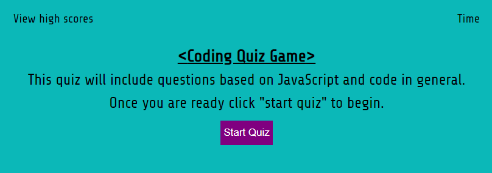

# Welcome to the Coding Quiz

## Description

Below you will see and be able to take a coding quiz. This quiz was created using HTML, CSS, and JAVASCRIPT. There is a working timer that starts at 75 seconds once you click "Start Quiz." You will also see a "View High Scores" option that allows you to see your previous scores.

## Screenshot

## Link to Quiz

* Here is the link to my github : [Github/JMGuzman-784](https://github.com/JMGuzman-784/hw4)

* Here is the pages : [JMGuzman-784/CodingQuiz](https://jmguzman-784.github.io/hw3/)
